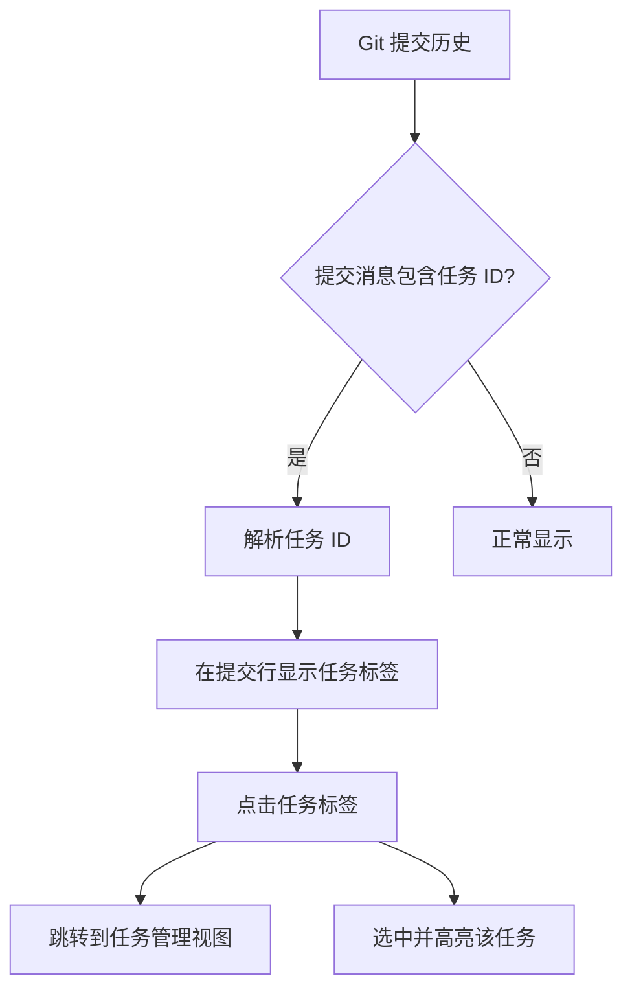
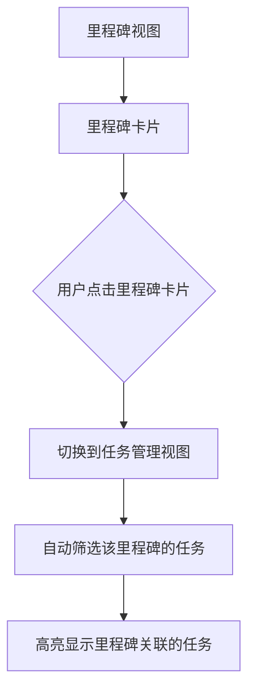

# GamePrince 功能增强实现计划

> 针对 Git 提交关联任务和里程碑关联任务快速跳转功能

---

## 📋 功能概述

本次实现两个功能增强：

| 功能 | 描述 | 优先级 |
|------|------|--------|
| **Git 提交关联任务** | 提交信息中包含任务 ID 时自动关联任务 | P1 |
| **里程碑任务快速跳转** | 从里程碑卡片点击可直接跳转到对应任务 | P1 |

---

## 1. Git 提交关联任务

### 1.1 需求分析

- 在 Git 提交历史中，当提交消息包含特定格式的任务 ID 时，自动关联任务
- 支持的格式：`#任务标题`、`[任务标题]`、或自定义前缀如 `T:任务标题`
- 在提交历史列表中显示关联的任务标签
- 点击任务标签可快速跳转到任务

### 1.2 数据模型修改

**TaskItem 添加新字段：**

```csharp
// 在 DataService.cs 的 TaskItem 类中添加
public List<string> LinkedCommits { get; set; } = new();  // 关联的提交哈希列表
```

### 1.3 实现方案



### 1.4 关键代码改动

#### 1.4.1 DataService.cs

- 修改 `TaskItem` 类，添加 `LinkedCommits` 字段

#### 1.4.2 GitService.cs

添加新方法用于匹配提交消息中的任务：

```csharp
/// <summary>
/// 从提交消息中提取任务标题并匹配任务
/// </summary>
public static List<TaskItem> MatchTasksFromCommit(List<TaskItem> allTasks, string commitMessage)
```

#### 1.4.3 MainWindow.xaml.cs

1. 修改 Git 提交历史显示逻辑：
   - 在显示提交列表时检查每条提交的消息
   - 如果匹配到任务，显示任务标签（带颜色）
   - 添加点击事件处理

2. 添加任务跳转方法：
   ```csharp
   private void NavigateToTask(TaskItem task)
   private void ScrollToAndHighlightTask(string taskTitle)
   ```

---

## 2. 里程碑关联任务快速跳转

### 2.1 需求分析

- 在里程碑卡片上显示关联的任务数量
- 点击里程碑卡片时自动切换到任务管理视图
- 自动筛选该里程碑下的所有任务

### 2.2 实现方案



### 2.3 关键代码改动

#### 2.3.1 CreateMilestoneCard 方法增强

在 [`MainWindow.xaml.cs`](MainWindow.xaml.cs:2034) 的 `CreateMilestoneCard` 方法中：

1. **添加任务数量显示**：
   ```csharp
   var relatedTasks = _tasks.Where(t => t.MilestoneId == milestone.Id).ToList();
   var taskCount = relatedTasks.Count;
   
   // 添加任务数量标签
   var taskCountLabel = new TextBlock 
   { 
       Text = $"{taskCount} 个任务",
       Foreground = Brushes.Gray,
       FontSize = 12
   };
   ```

2. **添加点击事件**：
   ```csharp
   // 将卡片设置为可点击
   cardBorder.Cursor = Cursors.Hand;
   cardBorder.MouseLeftButtonUp += (s, e) => NavigateToMilestoneTasks(milestone.Id);
   ```

#### 2.3.2 添加导航方法

```csharp
/// <summary>
/// 跳转到指定里程碑关联的任务
/// </summary>
private void NavigateToMilestoneTasks(string milestoneId)
{
    // 1. 切换到任务管理视图（TabControl.SelectedIndex = 1）
    // 2. 设置里程碑筛选条件
    MilestoneFilterComboBox.SelectedValue = milestoneId;
    // 3. 刷新任务列表
    RefreshKanbanView();
    // 4. 可选：高亮关联的任务
}
```

---

## 3. UI 改进示意

### 3.1 Git 提交历史中的任务关联显示

```
┌─────────────────────────────────────────────────────────────┐
│ 提交历史                                                  │
├─────────────────────────────────────────────────────────────┤
│ 🔵 a1b2c3d  2026-03-18  作者名称  完成功能A  [#任务A]       │
│ 🟢 d4e5f6g  2026-03-17  作者名称  修复Bug     [任务B]      │
│ 🟡 g7h8i9j  2026-03-16  作者名称  更新文档                │
└─────────────────────────────────────────────────────────────┘
```

### 3.2 里程碑卡片改进

```
┌─────────────────────────────────────────┐
│ 🎯 v1.0 里程碑                      ↗  │
│                                         │
│ 完成基础移动与战斗逻辑                  │
│                                         │
│ 📅 2026-03-18 → 2026-03-20             │
│ ████████████░░░░░░░ 60%                │
│                                         │
│ 📋 3 个任务  ● 2 进行中  ● 1 已完成    │
└─────────────────────────────────────────┘
          ↑ 点击跳转到任务列表
```

---

## 4. 实施步骤

### 步骤 1：数据模型修改

- [ ] 修改 `DataService.cs` 中的 `TaskItem` 类
- [ ] 添加 `LinkedCommits` 字段

### 步骤 2：Git 提交关联功能

- [ ] 在 `GitService.cs` 添加任务匹配方法
- [ ] 修改 `MainWindow.xaml.cs` 中的 Git 提交历史显示逻辑
- [ ] 添加任务标签显示和点击事件

### 步骤 3：里程碑任务跳转功能

- [ ] 修改 `CreateMilestoneCard` 方法
- [ ] 添加任务数量显示
- [ ] 添加点击事件处理
- [ ] 实现 `NavigateToMilestoneTasks` 方法

### 步骤 4：测试和优化

- [ ] 手动测试所有功能
- [ ] 修复发现的问题
- [ ] 更新改进计划文档

---

## 5. 技术风险

| 风险 | 描述 | 缓解措施 |
|------|------|----------|
| 任务匹配准确性 | 任务标题可能重复 | 使用唯一 ID 或精确匹配 |
| 性能影响 | 大量提交时匹配可能慢 | 添加缓存，只在视口加载时匹配 |
| UI 复杂度 | 添加交互可能影响现有 UI | 保持原有样式，只添加必要元素 |

---

## 6. 验收标准

- [ ] Git 提交历史中可显示关联的任务标签
- [ ] 点击任务标签可跳转到对应任务
- [ ] 里程碑卡片显示关联的任务数量
- [ ] 点击里程碑卡片可跳转到任务管理视图并筛选该里程碑的任务
- [ ] UI 符合现有 Glassmorphism 风格
- [ ] 不影响现有功能正常运行
